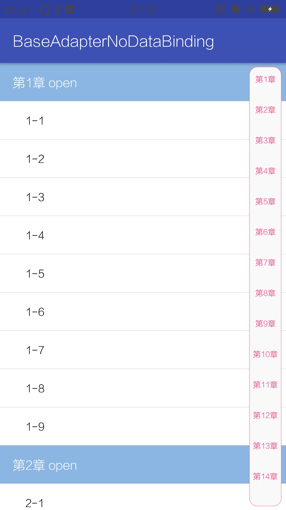
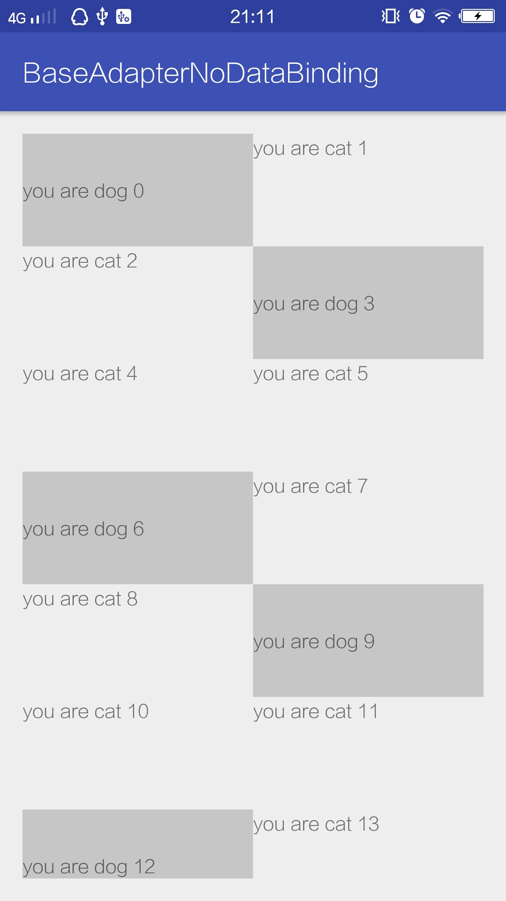
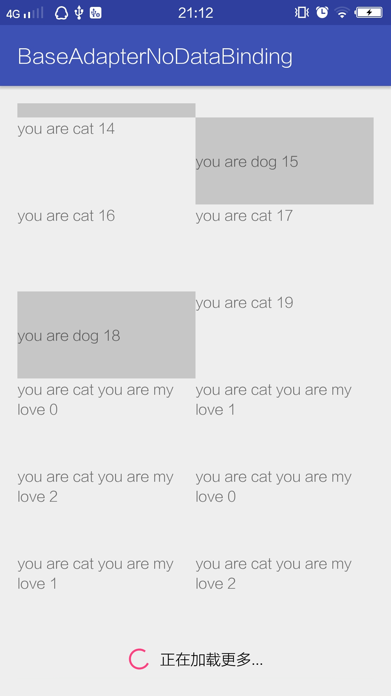
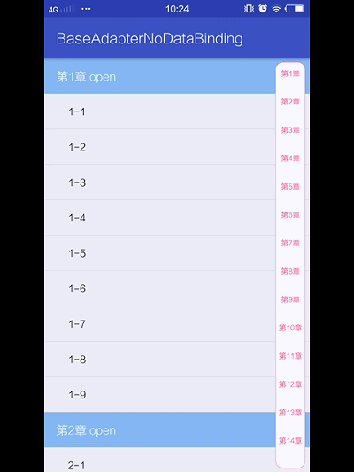

# BaseAdapterNoDataBinding
基础的RecyclerView Adapter封装类，支持侧边栏快速跳转，StickyHeader
## Feature ##
1. multiple type view
2. at the bottom of the load more
3. add WaveSideBar for quick jump list
4. support snap and sticky header
## ScreenShot ##
</img> </img> </img> </img>
## Thanks ##
[AdapterDelegates](https://github.com/sockeqwe/AdapterDelegates)  
[WaveSideBar](https://github.com/Solartisan/WaveSideBar)  
[RecyclerItemDecoration](https://github.com/dinuscxj/RecyclerItemDecoration)  
[RecyclerViewSnap](https://github.com/rubensousa/RecyclerViewSnap)  
## How to use ##
### user it for multiple type and load more ###
```
    protected void onCreate(Bundle savedInstanceState) {
        super.onCreate(savedInstanceState);
        setContentView(R.layout.activity_multi_type);
        recyclerView = (RecyclerView) findViewById(R.id.recycler_view);
        GridLayoutManager manager = new GridLayoutManager(this, 2);
        recyclerView.setLayoutManager(manager);
        initArray();
        recyclerView.setAdapter(new MultiTypeAdapter(itemArray, this));
    }

    private void initArray() {
        itemArray = new RecyclerViewItemArray();
        for (int i = 0; i < 20; i++) {

            if (i % 3 == 0) {
                itemArray.add(new ItemData<>(MultiTypeAdapter.TYPE_DOG, new Dog(i + "")));
            } else {
                itemArray.add(new ItemData<>(MultiTypeAdapter.TYPE_CAT, new Cat(i + "")));
            }
        }
        itemArray.add(new ItemData<>(MultiTypeAdapter.TYPE_LOADING, null));
    }

    int count = 1;

    @Override
    public void onRequestMore() {
        recyclerView.postDelayed(new Runnable() {
            @Override
            public void run() {
                List<Cat> cats = new LinkedList<>();
                for (int i = 0; i < 3; i++) {
                    cats.add(new Cat("you are my love " + i));
                }
                ((MultiTypeAdapter) recyclerView.getAdapter()).notifyAfterLoadMore(MultiTypeAdapter.TYPE_CAT, cats, count < 3);
                count++;
            }
        }, 2000);
    }
```
adpter  
```
    public static final int TYPE_CAT = 1;
    public static final int TYPE_DOG = 2;

    public MultiTypeAdapter(RecyclerViewItemArray itemArray, LoadingDelegate.OnRequestMoreListener listener) {
        super(itemArray);
        delegatesManager.addDelegate(TYPE_CAT, new CatDelegate());
        delegatesManager.addDelegate(TYPE_DOG, new DogDelegate());
        delegatesManager.addDelegate(TYPE_LOADING, new LoadingDelegate(listener, true));
        delegatesManager.addDelegate(TYPE_EMPTY, new EmptyDelegate(R.mipmap.ic_launcher));
    }
```

### use sticky header and side bar ###
```
       StickyHeaderDecoration decoration = new StickyHeaderDecoration(StickyHeaderAdapter.TYPE_CHAPTER);
        mRecyclerView.addItemDecoration(decoration);
        mRecyclerView.addOnItemTouchListener(new StickyHeaderTouchListener(this, decoration, this));
        mRecyclerView.setItemAnimator(new MyDefaultItemAnimator());
        new GravitySnapHelper(Gravity.TOP).attachToRecyclerView(mRecyclerView);
        mSideBarView.setOnTouchLetterChangeListener(new WaveSideBarView.OnTouchLetterChangeListener() {
            @Override
            public void onLetterChange(String letter) {
                int size = mItemArray.size();
                for (int i = 0; i < size; i++) {
                    ItemData data = mItemArray.get(i);
                    if (data.getDataType() == StickyHeaderAdapter.TYPE_CHAPTER) {
                        Chapter chapter = (Chapter) data.getData();
                        if (chapter.name.startsWith(letter)) {
                            LinearLayoutManager mLayoutManager =
                                    (LinearLayoutManager) mRecyclerView.getLayoutManager();
                            mLayoutManager.scrollToPositionWithOffset(i, 0);
                            return;
                        }
                    }
                }
            }
        });
```